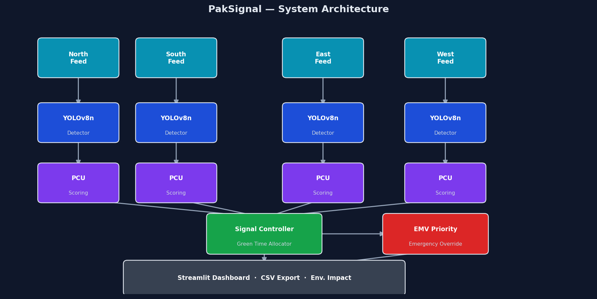
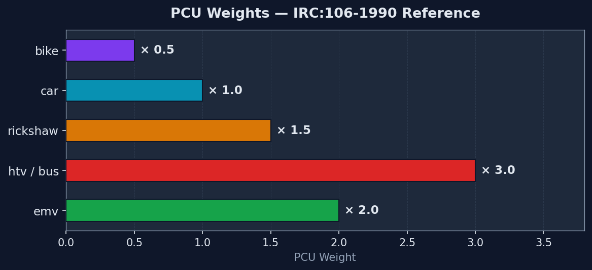
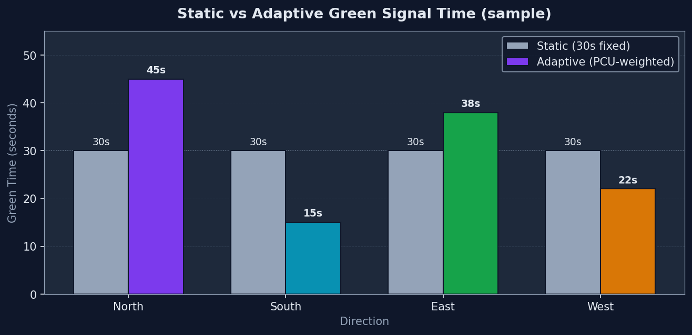
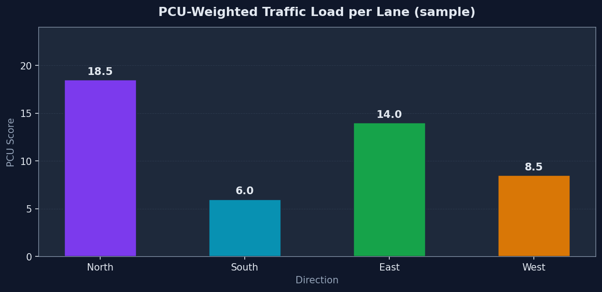
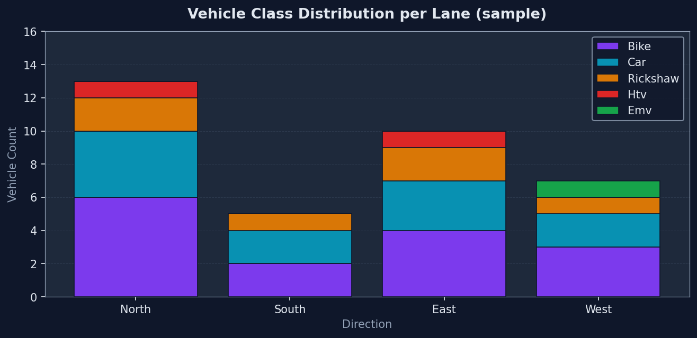

# 🚦 PakSignal

### YOLOv8-Based Adaptive Traffic Signal Control with PCU-Weighted Green Time Allocation for Pakistani Roads


---

> **YOLOv8 is the perception module. The actual contribution is adaptive traffic signal decision-making.**
>
> PakSignal detects local Pakistani vehicles from four directional feeds, converts counts into PCU-weighted traffic load, and recommends adaptive green signal timing — with emergency vehicle priority and environmental impact estimates.

---


## Dashboard Preview


---

## Table of Contents

- [System Architecture](#system-architecture)
- [Features](#features)
- [Dataset](#dataset)
- [PCU Weights](#pcu-weights)
- [Signal Allocation Logic](#signal-allocation-logic)
- [Environmental Impact Estimates](#environmental-impact-estimates)
- [Project Structure](#project-structure)
- [Setup & Installation](#setup--installation)
- [Training on Google Colab](#training-on-google-colab)
- [Running the Dashboard](#running-the-dashboard)
- [Demo Screenshots](#demo-screenshots)
- [Assumptions & Limitations](#assumptions--limitations)
- [Future Work](#future-work)

---

## System Architecture



The system has two layers:

| Layer | Component | Description |
|-------|-----------|-------------|
| **Perception** | YOLOv8n | Trained on Pakistani traffic dataset; detects `bike`, `car`, `rickshaw`, `htv`, `emv` |
| **Decision** | PCU Controller | Converts vehicle counts to traffic load; allocates green time; handles EMV priority |

**Pipeline:**

```
Four directional feeds (North / South / East / West)
            │
     ┌──────▼──────┐
     │  YOLOv8n    │  ← trained on density-traffic-controller-v1 v7
     │  Detector   │
     └──────┬──────┘
            │  vehicle counts per class
     ┌──────▼──────┐
     │  PCU Score  │  ← Σ (count × PCU_weight)
     │  Calculator │
     └──────┬──────┘
            │  PCU scores per lane
     ┌──────▼──────────────────┐
     │  Signal Controller      │
     │  • Proportional alloc.  │
     │  • EMV override         │
     │  • Starvation guard     │
     └──────┬──────────────────┘
            │
     ┌──────▼──────────────────────────────────┐
     │  Streamlit Dashboard                    │
     │  PCU charts · Green time · Env. impact  │
     │  CSV export · Detection preview         │
     └─────────────────────────────────────────┘
```

---

## Features

- **Pakistani vehicle detection** — bike, car, rickshaw, HTV (bus/truck), EMV
- **Four-direction support** — separate North / South / East / West feeds (image or video)
- **PCU-weighted traffic load** — converts mixed vehicle counts into a standardised traffic pressure score
- **Adaptive green time** — proportional allocation, clamped between configurable min/max
- **Emergency vehicle priority** — any lane with a detected EMV gets immediate maximum green time
- **Starvation prevention** — low-traffic lanes always receive a guaranteed minimum green time
- **Static vs adaptive comparison** — side-by-side table vs the classic 30-second fixed timer
- **Environmental impact estimates** — idle time saved → fuel (L) → CO₂ (g) → PKR cost
- **Demo mode** — simulated vehicle counts so you can explore the dashboard without `best.pt`
- **CSV export** — full lane results table downloaded in one click

---

## Dataset

| Property | Value |
|----------|-------|
| Source | Roboflow — `density-traffic-controller-v1` |
| Workspace | `fypszabist-i9gqf` |
| **Version used** | **v7** (confirmed by GreenFlow FYP authors) |
| Format | YOLOv8 |
| Classes (5) | `bike`, `car`, `emv`, `htv`, `rickshaw` |
| License | CC BY 4.0 |

> Only version 7 is used. Merging multiple Roboflow versions risks duplicate images, data leakage between splits, and artificially inflated accuracy metrics.

**Class normalisation** — the training notebook maps common name variants:

```
motorcycle / motorbike  →  bike
rikshaw / ricksha       →  rickshaw
bus / truck / coaster   →  htv
ambulance / emergency   →  emv
```

---

## PCU Weights

PCU (Passenger Car Unit) is a standard traffic engineering concept that converts mixed vehicle types into a common unit equivalent to one passenger car.



| Vehicle | PCU Weight | Rationale |
|---------|:----------:|-----------|
| bike | **0.5** | Takes roughly half the road space of a car |
| car | **1.0** | Baseline reference unit |
| rickshaw | **1.5** | Three-wheeler; wider and slower than a car |
| htv | **3.0** | Heavy transport (bus, truck, coaster) |
| emv | **2.0** | Emergency vehicle; also triggers priority override |

*Reference: IRC:106-1990 — Indian/Pakistani highway capacity guidelines.*

---

## Signal Allocation Logic

### 1. Proportional PCU allocation

```
green_time  =  (lane_PCU / total_PCU) × total_cycle_time
```

Clamped to `[min_green, max_green]` (default 15 s – 60 s, cycle = 120 s).

### 2. Emergency vehicle override

If any lane detects an EMV, that lane receives `60 s` unconditionally and all other lanes drop to `min_green` so the intersection clears immediately.

### 3. Starvation prevention

No lane receives less than `min_green` regardless of how low its PCU score is.

### 4. Static vs adaptive comparison

A fixed 30-second baseline is compared against the adaptive allocation for every lane. Positive difference = adaptive gives the lane more green time.



---

## Environmental Impact Estimates

> **Disclaimer:** All values are approximations for comparative analysis only. They are not exact field measurements. Diesel and CNG vehicles have different emission profiles.



| Constant | Value | Source |
|----------|-------|--------|
| Idle fuel consumption | 0.6 L/hr = 0.000166 L/s per vehicle | Literature average |
| CO₂ per litre petrol | 2 300 g/L | IPCC / EPA |
| Petrol price | 270 PKR/L | Pakistan 2024 average |

**Formula:**

```
saved_seconds  = max(0, adaptive_green − static_green)  per lane
fuel_saved     = saved_seconds × vehicle_count × 0.000166
co2_saved      = fuel_saved × 2300
pkr_saved      = fuel_saved × 270
```

---

## Project Structure

```
PakSignal/
│
├── docs/
│   └── images/                    ← auto-generated demo charts + screenshots
│       ├── architecture.png
│       ├── pcu_weights.png
│       ├── pcu_comparison.png
│       ├── green_time_comparison.png
│       └── vehicle_distribution.png
│
├── notebooks/
│   └── train_yolov8_colab.py      ← Colab training script (# %% cell markers)
│
├── models/
│   └── best.pt                    ← trained YOLOv8n weights (place here after training)
│
├── sample_feeds/                  ← test images/videos
│   ├── north.jpg  /  north.mp4
│   ├── south.jpg  /  south.mp4
│   ├── east.jpg   /  east.mp4
│   └── west.jpg   /  west.mp4
│
├── scripts/
│   └── generate_demo_images.py    ← regenerate docs/images/ charts
│
├── src/
│   ├── detector.py                ← YOLOv8 inference on image or video feed
│   ├── pcu_logic.py               ← PCU weights + scoring
│   ├── signal_controller.py       ← green time allocation + EMV priority
│   ├── environment.py             ← fuel / CO₂ / PKR impact estimates
│   └── utils.py                   ← class normalisation, helpers, CSV export
│
├── app.py                         ← Streamlit dashboard (entry point)
├── requirements.txt
└── README.md
```

---

## Setup & Installation

### Prerequisites

- Python 3.9+
- NVIDIA GPU recommended for inference (CPU works but is slower)

### Install

```bash
git clone https://github.com/<your-username>/PakSignal.git
cd PakSignal
pip install -r requirements.txt
```

### (Optional) Regenerate demo charts

```bash
python scripts/generate_demo_images.py
```

---

## Training on Google Colab

The training script is at `notebooks/train_yolov8_colab.py`. It uses `# %%` cell markers — paste each section into a Colab cell, or open it in VS Code as a notebook.

**Steps:**

1. Open [Google Colab](https://colab.research.google.com) and connect to a **T4 GPU** runtime
2. Upload the `density-traffic-controller-v1 v7` dataset folder to Google Drive
3. Paste the cells in order — the script will:
   - Install `ultralytics`
   - Mount Google Drive and locate `data.yaml` automatically
   - Train `yolov8n.pt` for 50 epochs (~30–45 min on T4)
   - Validate on the test split and print mAP metrics
   - Save `best.pt` to Drive
4. Download `best.pt` and place it at `PakSignal/models/best.pt`

**Expected metrics (v7 dataset):**

| Metric | Typical range |
|--------|---------------|
| mAP50 | 0.75 – 0.88 |
| mAP50-95 | 0.55 – 0.72 |
| Precision | 0.80 – 0.92 |
| Recall | 0.75 – 0.88 |

> Results depend on GPU, batch size, and dataset version. Run validation after training to get your exact numbers.

---

## Running the Dashboard

```bash
# From inside the PakSignal/ directory
streamlit run app.py
```

Opens at `http://localhost:8501`.

### Real YOLO mode

1. Make sure `models/best.pt` exists (train first or use your own weights)
2. Upload one traffic feed (image or video) per direction in the sidebar
3. Click **Analyze Traffic and Allocate Signal Timing**

### Demo mode

Tick **Demo mode** in the sidebar — the dashboard simulates realistic vehicle counts for all four directions so you can explore every feature without needing `best.pt`.

---

## Demo Screenshots

### Vehicle Distribution per Lane



### PCU Score per Lane


### Static vs Adaptive Green Time


## Demo Screenshots

### Dashboard Overview


### YOLOv8 Detection Preview


### Signal Decision and Impact Estimate


### Live Dashboard


### Detection Preview


---

## Assumptions & Limitations

- **Four feeds provided manually.** The system does not auto-detect direction from a single intersection camera. Each feed represents one road direction.
- **Video counts are averaged per frame**, not cumulated over the entire video. Cumulation over long videos inflates counts artificially.
- **Environmental values assume all vehicles are petrol-fuelled** and idle at a uniform rate. Diesel / CNG vehicles have different emission profiles.
- **PCU allocation does not model pedestrian crossing phases or turn arrows.**
- **The system is a snapshot-based controller**, not a real-time queue simulator. Each analysis run treats the uploaded feed as a representative current-state snapshot.

---

## Future Work

| Enhancement | Notes |
|-------------|-------|
| **DQN / Reinforcement Learning** | Replace PCU controller with a DQN agent trained in a Gymnasium-compatible simulator (e.g. SUMO). DQN requires reward design, a full traffic sim, and long training — deferred to future work. |
| Real CCTV integration | RTSP stream support for live intersection feeds |
| Night / rain robustness | Pre-processing pipeline (CLAHE, defogging) before YOLO inference |
| Larger balanced dataset | More Pakistani cities; better qingqi-rickshaw representation |
| Ground-truth validation | Actual signal controller deployment for field comparison |
| Pedestrian phases | Extend signal logic to include pedestrian crossing windows |

---

## TA / Examiner Summary

> *"YOLOv8 is not the whole project. It is the perception layer. The actual contribution is an adaptive signal allocation system for Pakistani roads. The model detects local vehicle classes from four directional feeds, converts detections into PCU-weighted traffic load, recommends adaptive green signal timing, prioritises emergency vehicles, and estimates fuel/CO₂/cost savings compared to a fixed 30-second timer."*

---

## License

Dataset: **CC BY 4.0** — [density-traffic-controller-v1](https://universe.roboflow.com/fypszabist-i9gqf/density-traffic-controller-v1) by fypszabist on Roboflow Universe.


---

*Semester project — Deep Learning, 2026 spring*
